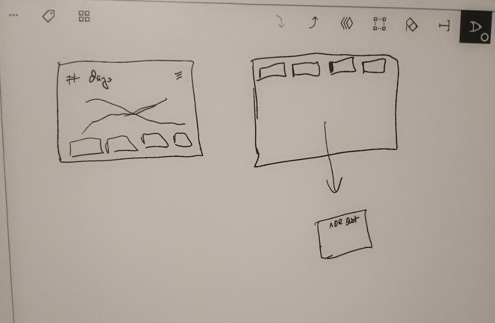

### 12/06/2025

11:52 AM

I've been trying to write code for the past like hour and I keep having distractions

I've been thinking (that I write the same app over and over again)

This is for debt:

- [ ] basic form that takes in: name, balance, APR, due date, min due (varies)
- [ ] these are stored in localStorage (this app is for me, will be a desktop app)
- [ ] another form to enter current balance
- [ ] button that you click
- [ ] the button after clicked it goes through the list of accounts and asks for all their balances
- [ ] these updated values will be stored in another localStorage item

I gotta see what I've been working on

12:05 PM

I went out last night and I didn't sleep well so I'm kind of struggling

Gotta lift and run later at 2PM

12:14 PM

It's funny I'm partially def right now can barely hear out of my left ear, also my left stereo is weaker

### 12/04/2025

Alright so I looked into a popular or well-known (heh) company that deals with logging into finance accounts and it turns out it's not for us mere plebs which I'm like f it I don't care, this software is for me.

Still I was disappointed, considering I have like 20 accounts and it's a PITA to log into all of them

Most of these accounts are debt btw

like 90% lmao I'm f'd

so yeah I'll go for this automated form thing that just goes over a list of my accounts and asks me to log the balance

anyway I need to nail this... I'm tired of being poor

### 11/19/2025

6:53 PM

I decided I'm not donating plasma anymore. I drop about 4 hours a week on that to get $115 (minus taxes).

Now that I'm billing full hours I'm not doing bad.

But yeah, I just looked at my finances it'll take me at best 9-10 months to pay off my non-student loan, non-personal debt...

So I'll pay off the highest interest/growing ones first in case I do lose my job (always a fear) I'm a contractor/never know with the market although I'm doing good performance-wise.

I'm doing some thinking right now can't really code

### 11/18/2025

6:54 PM
Well I'm not doing Uber Eats on my weekends anymore so I do feel like I have more time. Although I will admit my first weekend so far I didn't do shit. I just watched a lot of YouTube which is something I'm trying to do less of. It's not education just whatever garbage and sometimes you gotta do that, do nothing.

I do feel like I keep re-writing apps, it's like here we go, another modal that collects info and stores a debt object

I have some forced holiday coming up, forced I say as in I won't get paid for it but it's nice, looking forward to that in December. Have a short break around thanksgiving.

I do feel myself wanting to do better like not being absolutely broke/waiting for next paycheck, getting out of debt, eating healthier/trying to lose weight.

I've been good about not going out, when I drink near the weekend I do it at home and just play Battlefield 6.

Anyway let me build that modal.

7:03 PM
I don't know why it's hard to start, I don't want to do it, I just want to veg out

I ran today so there's a positive

7:06 PM
There is this thing I'm trying to get myself to do where I sit in silence, (meditate?) and just stop being plugged into the web for a minute.

I always have something playing, music, YouTube video, a podcast, something...

As somebody wrote, "embrace boredom"

7:11 PM
What do I want out of this?

I want to see the end of my debt, how long it will take, make it tangible, something I aspire to

I just feel like I'm just going with the flow

I'm trying to do this silent session right now

7:22 PM
Didn't get it, I actually almost passed out on my futon ha tired

7:39 PM
Ehh I'm not feeling it, some progress but not much

### 10/08/2025

7:52 PM

Alright back on, decided to weather the storm

I just donated plasma, while I did start fasting today I just realized how many caloires beer is

So yeah, I gotta stick to my 2 days a week on that which... idk I get done driving uber eats at 11 PM I'm like ehhh let's drink and play video games

But damn a can is 220 calories fuuhhhhhh and I'm drinking 6 boy

I increased my bench today I'm at 260 lbs assisted, it's a bit, I did 4 reps and then I was like oh f

I'm gonna write some brief code, the basic component tabbing system, I've made multiple of these already

### 10/07/2025

6:03 PM
I am reminded again today why this needs to be the #1 priority in my life

I'm just trapped without having savings/always worrying about losing my job

But I have survived working in a warehouse and what not

I'm just a dumbass, moment I have money I just burn it

It's a self-made problem, I've been fortunate

Calendars can be hard with regard to day splitting I mean they are defined 28/30/31.

A key feature is being able to swap income/automatic dispursement/calculate pay off... as in going from six figs to eating stale figs (ehh terrible pun)

I'm drinking right now, nothing hard just a 6-pack of 9.5% ale

Finally gonna bust out the remarkable 2 again

6:26 PM

There is a neat feature I have thought about, it shows falling leaves animated

This is a tough problem because it needs to factor in other uses of money eg. bills which are not debt

Spreadsheet is the goat, it's always there, I use it to wireframe stuff

We'll do it simple, 3 tabs:

- bills
- debt
- income

That'll be the main parts to do the formula

4

will need a home tab

6:43 PM

I don't really have a specific design just something vague, will start building the pieces

6:54 PM
I feel too sad right now to think

I will write something down

F meeeee man I'm broke already... it's crazy how much debt I have and it's not even that much

I'm looking at $100K+ Porsches lmao you're broke and have a day job

No I'm past the Porsche phase, trying to get me that Lotus Exige

7:01 PM

I'll round up too, nearest dollar

Ahh man... it's tough I work 7 days a week and right now I don't want to do shit I just want to drink and be sad lol

7:52 PM

3 9.5% beers in, I think about this meme sometimes this guy's like "there is no passion! ambition! etc..." it's funny

But yeah I've just gotten used to accepting/waiting for this 2 week paycheck

8:55 PM

I need to make debt payment like a drug

Is the $6 caeasar salad that I eat too expensive? Idk... but maybe it buys me another 5 mins of my life

Emotions is so funny

Like here I am healthy, a 6-fig job, all I have to do is say "yes sir"

But I'm sad

So I'm self-sabotaging

Robots don't need emotion

### 10/06/2025

I have not been writing much code for myself lately. Just been working, dayjob writing code and then driving Uber Eats. Also been drinking 4 days out of 7.

I drive 4PM-11PM on Sat/Sunday after working out beforehand.

I've been thinking about this, the main thing to get out of it is a number of months/year(s).

The card/debt is an object and it goes into a calculator to get that value then you sum them.

Breaking things off maybe modulus in months but also the calculation changes as the principal goes down over time.

I just want to see something to work towards/progress.

You can see it with a spreadsheet of reducing balances over time but a definitive number would be nice.
